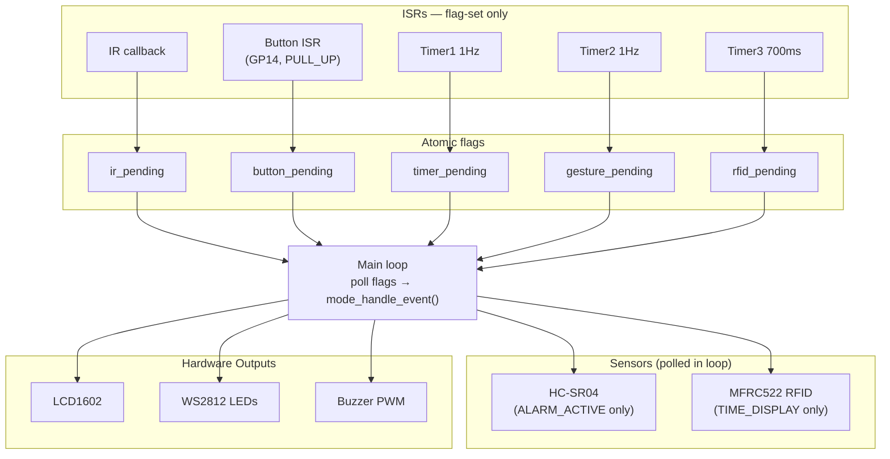
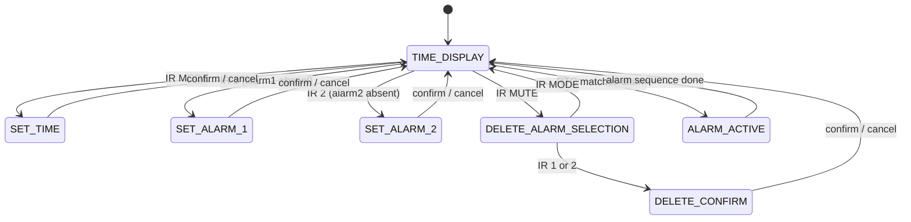
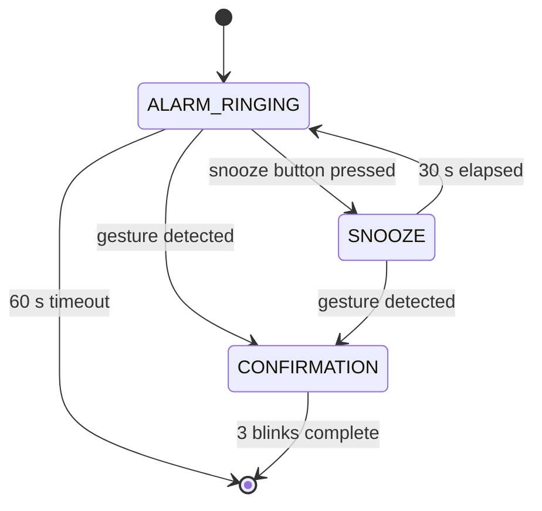

# FSM Alarm Clock

## Introduction

An FSM-based smart alarm clock built on the **Raspberry Pi Pico** (MicroPython). Users set times and alarms via an IR remote; the alarm is stopped by waving a hand in front of an ultrasonic sensor or snoozed with a physical button. Scanning an RFID card shifts the displayed time by +13 hours. A WS2812 LED strip provides visual feedback for alarm status throughout.

**Features at a glance:**

- Two independent alarms with enable/disable toggle
- Three stop mechanisms: **gesture** (ultrasonic wave-off), **snooze button** (30 s delay), **60 s auto-timeout**
- RFID card → +13-hour time shift
- IR remote full control (set time, set alarm, delete alarm, power off)
- Non-blocking UI: all messages are timer-driven; no `time.sleep()` in the main loop

**Key concepts applied:**

- ISR flag-set architecture — all handlers are non-blocking; main loop polls flags
- Top-level FSM + nested Sub-FSM for alarm sequence management
- Hardware EMI mitigation: PULL_UP + 50 ms debounce + double-check pin verification
- Single-source timer discipline: hardware timer is the only cadence authority

## Demo Video

  

    <iframe
      src="https://www.youtube.com/embed/g99llM1LRGQ"
      title="FSM Alarm Clock Demo"
      allow="accelerometer; autoplay; clipboard-write; encrypted-media; gyroscope; picture-in-picture; web-share"
      allowfullscreen>
    </iframe>
  

## System Overview

The system uses five ISRs that set atomic flags, and a main event loop that processes them in priority order. No ISR ever blocks or writes to hardware.

**ISR sources:**

| ISR | Trigger | Flag set |
|-----|---------|----------|
| `ir_callback` | NEC_8 IR decode complete | `ir_pending` + `last_ir_value` |
| `button_isr` | GP14 falling edge (ALARM_ACTIVE only) | `button_pending` |
| `timer_isr` | Timer1, 1 Hz periodic | `timer_pending` |
| `gesture_check_isr` | Timer2, 1 Hz periodic | `gesture_pending` |
| `rfid_poll_isr` | Timer3, 700 ms periodic | `rfid_pending` |

**Main loop event priority** (processed top-to-bottom each 5 ms cycle):

1. IR remote events
2. Snooze button (debounce + pin state re-check before acting)
3. Timer tick (time display, alarm cadence, confirmation blink)
4. Gesture sensor — HC-SR04 polled only during `ALARM_ACTIVE`
5. RFID reader — non-blocking poll only during `TIME_DISPLAY`

## Hardware

| Component | Pin(s) | Protocol | Notes |
|-----------|--------|----------|-------|
| **LCD1602** | SDA=GP4, SCL=GP5 | I2C0 | Address 0x27; 16-char padding prevents residue |
| **IR Receiver** | GP13 | NEC_8 via ISR | Decodes 0x45–0x4A key codes |
| **RFID MFRC522** | SCK=GP18, MOSI=GP19, MISO=GP16, CS=GP17, RST=GP9 | SPI0 | Non-blocking `rfid_read_no_block()` |
| **HC-SR04 Ultrasonic** | TRIG=GP11, ECHO=GP12 | GPIO | 5 consecutive reads < 8 cm = gesture stop |
| **WS2812 LED Strip** | GP0 | One-wire | Index 0 = Alarm 1 status; Index 1 = Alarm 2 status |
| **Buzzer** | GP15 | PWM 2 kHz | Toggled by state flags; never driven inside ISR |
| **Snooze Button** | GP14 | GPIO PULL_UP | `IRQ_FALLING`; 50 ms debounce + pin re-read in main loop |

## FSM Design

The system uses a **two-layer FSM**: a top-level FSM handles 7 modes; when the system enters `ALARM_ACTIVE` all events are delegated to an alarm Sub-FSM with 3 internal sub-modes.

### Top-Level FSM

| Mode | LCD shows | Entry from | Exits to |
|------|-----------|------------|----------|
| `TIME_DISPLAY` | `HH:MM:SS AM/PM` | startup / any mode | SET_TIME, SET_ALARM_x, DELETE, ALARM_ACTIVE |
| `SET_TIME` | `Set Time (HHMM)` | IR MODE | TIME_DISPLAY (confirm/cancel) |
| `SET_ALARM_1` | `Set Alarm 1` | IR 1 (no alarm) | TIME_DISPLAY (confirm/cancel) |
| `SET_ALARM_2` | `Set Alarm 2` | IR 2 (no alarm) | TIME_DISPLAY (confirm/cancel) |
| `DELETE_ALARM_SELECTION` | `Delete Alarm` | IR MUTE | DELETE_CONFIRM / TIME_DISPLAY |
| `DELETE_CONFIRM` | `Delete Alarm X?` | SELECT 1 or 2 | TIME_DISPLAY (confirm/cancel) |
| `ALARM_ACTIVE` | Sub-FSM controls | alarm time match | TIME_DISPLAY (alarm finished) |

### Alarm Sub-FSM (inside `ALARM_ACTIVE`)

| Sub-mode | Behavior | Exit condition |
|----------|----------|----------------|
| `ALARM_RINGING` | LED red blink + buzzer at 1 Hz | snooze button → SNOOZE; gesture → CONFIRMATION; 60 s → exit |
| `SNOOZE` | Silent, LCD shows current time | 30 s elapsed → resume ALARM_RINGING; gesture → CONFIRMATION |
| `CONFIRMATION` | LED white blink × 3, then green | 3 cycles complete → exit to TIME_DISPLAY |

## Key Challenges

### 1. Buzzer EMI Triggering False Snooze Presses

With the snooze button configured as `PULL_DOWN`, the input pin floated near 1.5 V when idle — well within the noise margin of the 2 kHz buzzer PWM. Random false `IRQ_FALLING` edges fired during every alarm.

**Fix:** Switched to `PULL_UP` (pin held at stable 3.3 V; button grounds it). Raised debounce from 10 ms → 50 ms. Added a double-check: ISR sets flag, main loop **re-reads the pin** before acting — if the pin already returned high it was a transient, not a real press.

### 2. LCD Residue and Alarm Flicker

Variable-length strings left stale characters on the display. Calling `lcd.clear()` before every update caused a visible flash at 1 Hz.

**Fix:** All strings padded to exactly 16 chars. `lcd.clear()` removed from the per-tick path; lines are updated in place with `lcd.write(col, row, padded_string)`.

### 3. Snooze Message Instantly Overwritten

"Snoozed 30 sec" appeared for less than one frame before the alarm render path overwrote it.

**Fix:** Centralized `show_temp_message(msg, duration_ms)` stores a deadline timestamp. Every `EV_TIMER_TICK` handler checks the deadline first; if the message is still live, the normal screen render is skipped until it expires.

### 4. Buzzer/LED Rhythm Drift (Dual Timing Layers)

An extra `time.ticks_diff()` gate inside the alarm tick handler was intended to blink at 500 ms, but the hardware timer fired at 1000 ms. The two clocks drifted under main-loop load, causing occasional skipped beats.

**Fix:** Removed the software gate entirely. The 1 Hz hardware timer is the sole cadence authority — every `EV_TIMER_TICK` toggles the flags directly. No secondary timing math needed.

### 5. Silent/Dark First Beat After Snooze Resume

On snooze timeout the alarm resumed, but `alarm_led_on` and `alarm_buzzer_on` flags retained their last-toggled values — sometimes both `False` — so the first second was silent and dark.

**Fix:** On every entry into `ALARM_RINGING` (initial trigger or snooze resume), both flags are explicitly set to `True` and `update_alarm_outputs()` is called before the tick loop begins.

## What I Learned

- **Hardware EMI looks like software bugs.** Random false triggers initially seemed like debounce logic errors; the root cause was inadequate pin configuration. Measure before writing workarounds.
- **One timing authority only.** Nesting a software `ticks_diff()` check inside a hardware-timer callback introduces a redundant clock that drifts. Let the hardware timer be the sole source of truth.
- **State flags separate logic from hardware.** Splitting `alarm_led_on` / `alarm_buzzer_on` flags from the `update_alarm_outputs()` hardware call made FSM transitions testable independent of the physical outputs.
- **Non-blocking UI is non-negotiable on a single-threaded MCU.** Any `time.sleep()` in the event loop freezes all other inputs. The temp-message system with a timestamp deadline was the key to eliminating all blocking delays.
